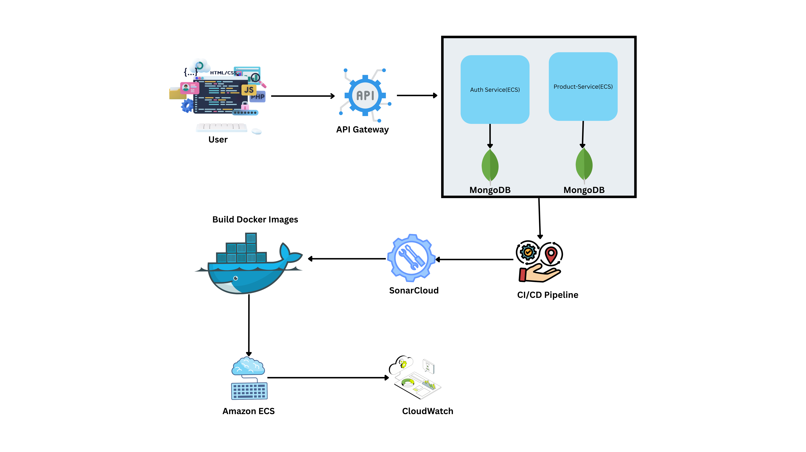

# 🌟 Microservices-Based Application: Authentication and Product Catalog Services 🌟

Welcome to the repository for our e-commerce platform's microservices! This project features two essential services: **Authentication Service** and **Product Catalog Service**. Both services are containerized, deployed on AWS ECS using Fargate, and secured with modern DevOps and DevSecOps practices. 

## 📚 Table of Contents
- [Project Overview](#project-overview)
- [Architecture](#architecture)
- [Features](#features)
- [Endpoints](#endpoints)
- [Technologies Used](#technologies-used)
- [Setup and Running Instructions](#setup-and-running-instructions)
- [Deployment](#deployment)
- [Security Measures](#security-measures)
- [Images](#images)
- [Contributing](#contributing)
- [License](#license)

## 🚀 Project Overview
This project demonstrates the implementation of a **secure**, **scalable**, and **containerized** microservices-based application. The two microservices are:

- **Authentication Service**: Handles user registration, login, email verification, password reset, and token-based authentication using JWT.
- **Product Catalog Service**: Manages product and category data for an e-commerce platform, including CRUD operations for products and categories.

Both services are deployed on AWS ECS using Fargate and are accessible via an Application Load Balancer.

## 🏗️ Architecture
The application follows a microservices architecture deployed on AWS. Below is the architecture diagram:



### **Components**:
- **Frontend**: A web-based interface for users to interact with the services.
- **AWS Application Load Balancer**: Routes traffic to the appropriate microservice based on the URL path.
- **ECS Cluster**: Hosts the containerized microservices using AWS Fargate.
- **MongoDB Atlas**: A managed NoSQL database for storing user and product data.

## ✨ Features

### **Authentication Service**
- ✅ User registration with email verification.
- 🔒 Secure login with JWT-based authentication.
- 🔄 Password reset functionality.
- 🔑 Token refresh mechanism.
- 👤 Role-based access control (RBAC) for admin and customer roles.

### **Product Catalog Service**
- 📦 CRUD operations for products and categories.
- 📊 Pagination, filtering, and sorting for product listings.
- 🔐 Role-based access control for admin-only endpoints.

## 📡 Endpoints

### **Authentication Service**

| Endpoint | Method | Access Role | Description | Security Features |
|----------|--------|-------------|-------------|-------------------|
| `/api/auth/register` | POST | Public | Register a new user. | Password hashing, input validation |
| `/api/auth/login` | POST | Public | Login and receive access/refresh tokens. | JWT-based authentication |
| `/api/auth/verify-email` | POST | Public | Verify user email using a token. | Token-based email verification |
| `/api/auth/refresh-token` | POST | Public | Refresh access token using a refresh token. | Secure refresh token validation |
| `/api/auth/logout` | POST | Public | Logout and invalidate refresh token. | Token invalidation |
| `/api/auth/forgot-password` | POST | Public | Send password reset email. | Email-based token validation |
| `/api/auth/reset-password` | POST | Public | Reset password using a token. | Token-based password reset |

### **Product Catalog Service**

| Endpoint | Method | Access Role | Description | Security Features |
|----------|--------|-------------|-------------|-------------------|
| `/api/products` | GET | Public | Retrieve all products with pagination. | None |
| `/api/products/:id` | GET | Public | Retrieve a specific product by ID. | None |
| `/api/products` | POST | Admin | Create a new product. | Role-based access control (RBAC) |
| `/api/products/:id` | PUT | Admin | Update an existing product. | Role-based access control (RBAC) |
| `/api/products/:id` | DELETE | Admin | Delete a product. | Role-based access control (RBAC) |
| `/api/categories` | GET | Public | Retrieve all categories. | None |
| `/api/categories/:id` | GET | Public | Retrieve a specific category by ID. | None |
| `/api/categories` | POST | Admin | Create a new category. | Role-based access control (RBAC) |
| `/api/categories/:id` | PUT | Admin | Update an existing category. | Role-based access control (RBAC) |
| `/api/categories/:id` | DELETE | Admin | Delete a category. | Role-based access control (RBAC) |

## 🛠️ Technologies Used
- **Backend**: Node.js, Express.js
- **Database**: MongoDB Atlas
- **Authentication**: JSON Web Tokens (JWT)
- **Containerization**: Docker
- **Cloud Deployment**: AWS ECS (Fargate), Application Load Balancer
- **CI/CD**: GitHub Actions
- **DevSecOps**: SonarCloud for static code analysis
- **Security**: Helmet.js, bcrypt.js, rate limiting

## ⚙️ Setup and Running Instructions

### **Prerequisites**
- Node.js (v18 or higher)
- Docker
- AWS CLI configured with appropriate credentials
- MongoDB Atlas account

### **Steps to Run Locally**
1. Clone the repository:
   ```bash
   git clone https://github.com/your-repo/microservices-app.git
   cd microservices-app

2. **Set up environment variables**:
    - Create a `.env` file in both `auth-service` and `catalog-service` directories.
    - Add required variables by referencing the `.env.example` files [[1]] [[2]] [[3]] [[5]] [[8]].

3. **Start services**:
    ```bash
    docker-compose up --build
    ```
    - Access services locally:
        - Authentication Service: `http://localhost:3000/api/auth`
        - Product Catalog Service: `http://localhost:3001/api/products`

## 🚀 Deployment (AWS ECS)
**Infrastructure**: Deployed on AWS ECS using Fargate with GitHub Actions automation.

**Deployment Steps**:
1. Push changes to `main` branch
2. GitHub Actions pipeline:
    - Build Docker images
    - Push images to Amazon ECR
    - Update ECS services with new images [[3]] [[8]]
  
**Deployed Endpoints**:
- Authentication Service: `http://<ALB-DNS>/api/auth`
- Product Catalog Service: `http://<ALB-DNS>/api/products`

## 🔒 Security Measures
- **JWT Authentication**: Short-lived tokens + refresh tokens
- **Password Hashing**: `bcrypt` for stored passwords
- **Rate Limiting**: Enabled for login/registration endpoints [[2]] [[3]] [[8]]
- **Secret Management**: Sensitive variables stored in `.env`/AWS Secrets Manager [[10]]
- **RBAC**: Admin-only endpoint protection
- **Code Analysis**: SonarCloud integrated for vulnerability detection

## 🤝 Contributing
1. Fork the repo
2. Create feature branch: `feature/your-feature-name`
3. Commit changes & push
4. Create pull request

## 📜 License
- MIT License (see `LICENSE` file)
